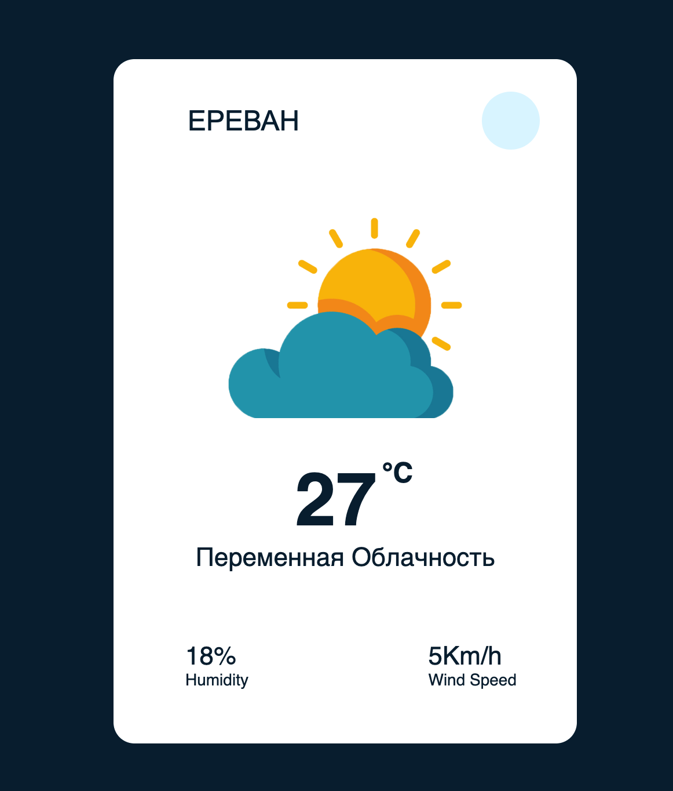

# 🌤️ Weather App

A simple and responsive weather app built with HTML, CSS, and JavaScript that fetches real-time weather data using the [OpenWeatherMap API](https://openweathermap.org/api).

## 📸 Preview



---

## 🚀 Features

- Search weather by city name
- Displays:

  - Temperature (°C)
  - Weather description
  - Humidity (%)
  - Wind speed (km/h)

- Changes weather icon dynamically based on conditions
- Handles city not found (404) errors gracefully
- Responsive UI with smooth fade-in animation

---

## 🛠️ Technologies Used

- HTML5
- CSS3
- JavaScript (Vanilla)
- OpenWeatherMap API

---

## 📦 Getting Started

### 1. Clone the repository

```bash
git clone https://github.com/martasusenkova/WeatherApp_JS.git
```

### 2. Add your API key

Open `script.js` and replace the API key string:

```javascript
const APIKey = "your_api_key_here";
```

> You can get a free API key by signing up at [openweathermap.org](https://openweathermap.org/api).

### 3. Run it locally

Just open the `index.html` file in your browser.

---

## 📁 File Structure

```
weather-app/
│
├── index.html         # Main HTML file
├── style.css          # Styling
├── script.js          # JavaScript logic
└── images/            # Weather icons
```

---

## 💡 Future Improvements

- Add forecast (5-day)
- Allow geolocation-based search
- Support multiple languages
- Improve UI design

---

## 🧠 Inspiration

This project was created as a practice for working with APIs, JavaScript DOM manipulation, and creating responsive UIs.
